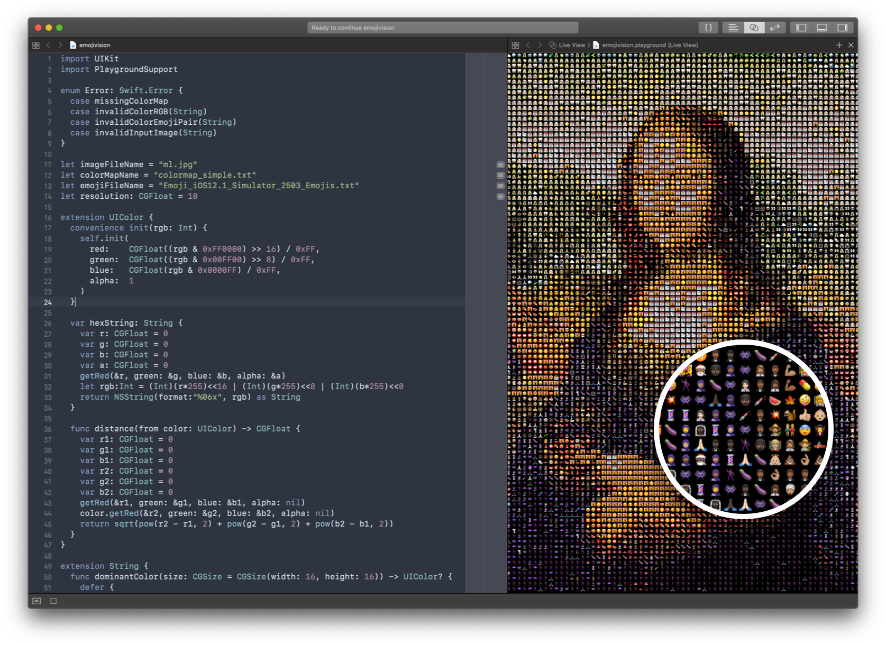

# ✨👯‍♀️emojivision👁👄👁👯‍♀️✨

A 200 something line Swift Playground for rendering images as emojis.

At the top of the file are a few constants:
`imageFileName` - The input image
`colorMapName` - The palette to sample from 
`emojiFileName` - The file to generate the palette from
`resolution` - EmojiDensity™

Included in the source is a dump of all iOS12 emojis (sourced from [EmojiDump](https://github.com/liuyuning/DumpEmoji)). The function `generateColorMap` reads that file and exports a newline-separated text file containing the dominant color in each emoji. That output file is then specified by `colorMapName`. You'll note that the included color map has far fewer entries than the comprehensive emoji dump, which is a performance requirement. Here's how it works:

1. Go through every few pixels of the image (specified by `resolution`) and get the color of that pixel
2. Treating each color's rgb as a 3d vector, compare the euclidian distance of that color with every color in the provided palette, and get the color with the nearest distance
3. Get the emoji associated with that color value from a precomputed dictionary of colors to emojis
4. Draw the emoji in the rect occupied by the current pixel with dimension specified by `resolution`

For your convenience, code at the end of the file outputs your artwork to `~/Documents/Shared Playground Data/out.png`. Note that this directory needs to exist beforehand 🙄.

- gabrieloc 

PS: this was done as a proof of concept and the right way to do things would be to offload more to the GPU, such as finding nearest colors and rendering of emojis 🤷‍♂️
